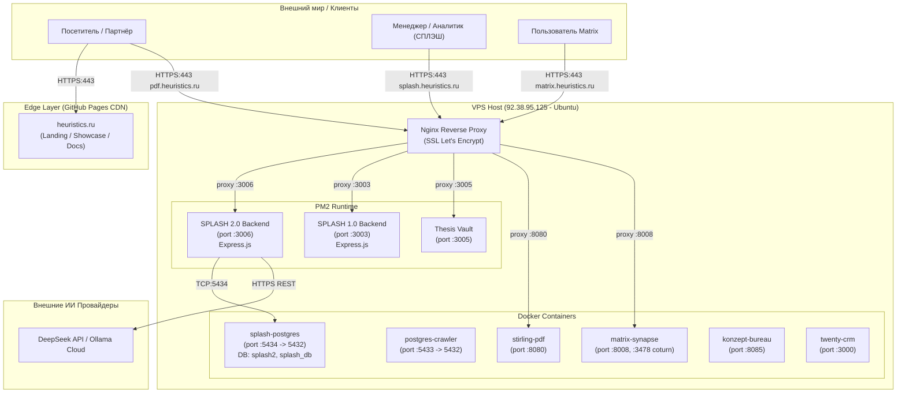

> 🤖 Документация сгенерирована автоматически с помощью скилла **arc42-documenter**.

# 3. Границы системы и контекст (System Scope and Context)

## 3.1 Бизнес- и технический контекст

Экосистема разделена на два ключевых контура:
1. **Edge / Презентационный контур (GitHub Pages + DNS):** Обслуживает статический фронтенд `heuristics.ru` через CDN GitHub с поддержкой HTTPS.
2. **Core / Вычислительный контур (VPS 92.38.95.125):** Обслуживает поддомены, Nginx reverse proxy, Node.js бэкенды (PM2), Docker-контейнеры и базы данных PostgreSQL.

## 3.2 Описание внешних и внутренних интерфейсов

| Узел | Протокол / Порт | Назначение |
|---|---|---|
| **heuristics.ru** | HTTPS:443 (GitHub Pages) | Статический представительский сайт, документация методов, API и публикаций. |
| **splash.heuristics.ru** | HTTPS:443 → `localhost:3006` | Прикладная SPA и REST API v2 для подбора аналогов кабельной продукции. |
| **pdf.heuristics.ru** | HTTPS:443 → `localhost:8080` | Автономный сервис инженерии и конвертации PDF документов (Stirling-PDF). |
| **matrix.heuristics.ru** | HTTPS:443 → `localhost:8008` | Защищённый Matrix homeserver + Coturn STUN/TURN сервер для аудио/видео. |
| **PostgreSQL 15 (`splash-postgres`)** | Внутренний порт `5434` | Хранилище номенклатуры (15 469 SKU), правил сопоставления, весов осей и сессий. |
| **LLM Provider** | HTTPS REST | Генерация товарных описаний и распознавание сложных сущностей в сметах. |
