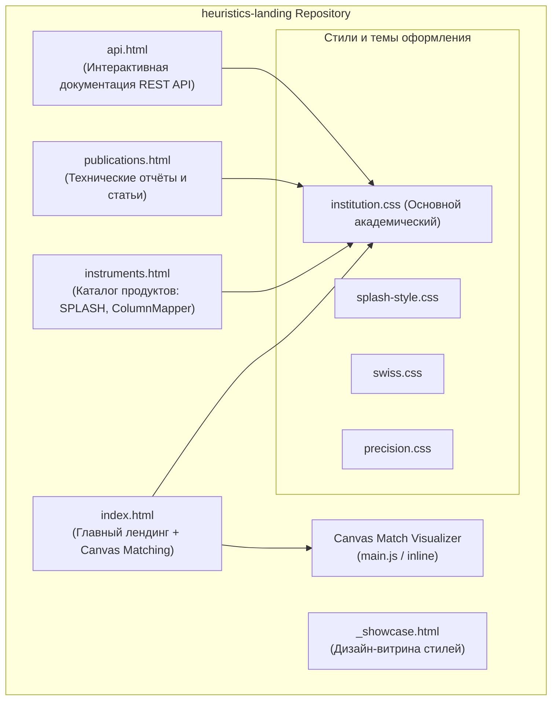
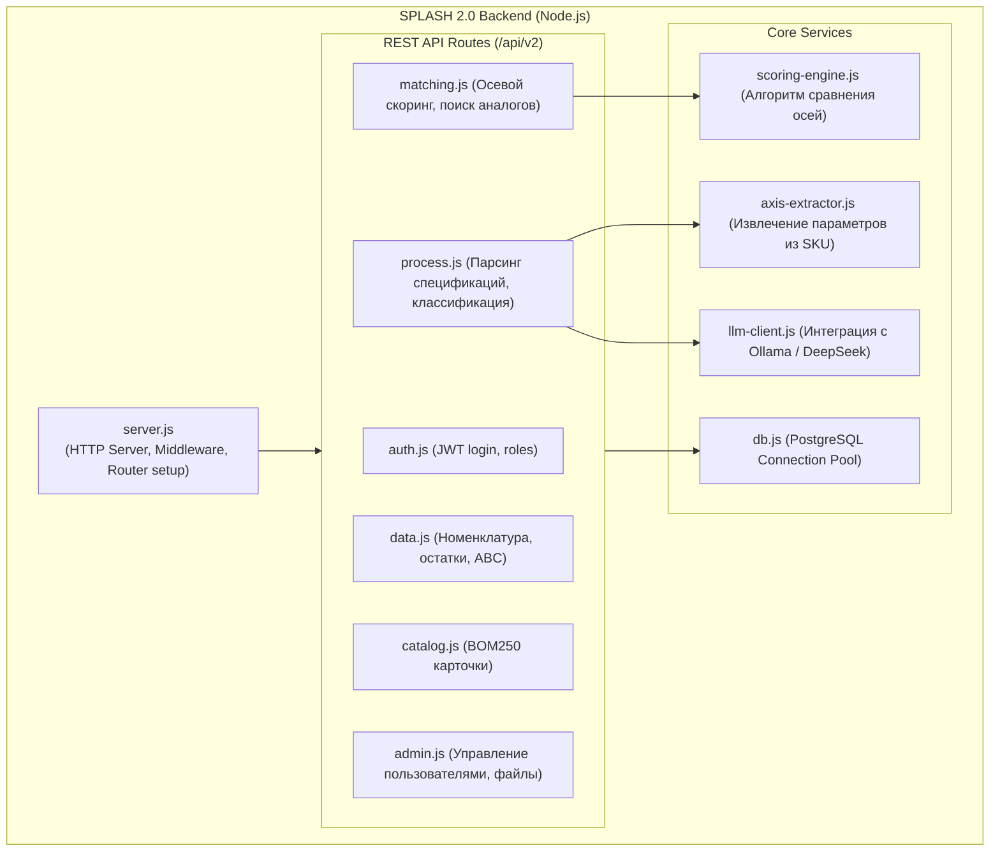

> 🤖 Документация сгенерирована автоматически с помощью скилла **arc42-documenter**.

# 5. Структура компонентов (Building Block View)

## 5.1 Уровень 1: Компоненты лендинга и фронтенд-модулей

Репозиторий `heuristics-landing` организован как модульный набор статических страниц и визуализаций:

## 5.2 Уровень 2: Компоненты бэкенда СПЛЭШ 2.0 (`splash2`)

Бэкенд СПЛЭШ 2.0 представляет собой модульный Express.js монолит:

## 5.3 Ответственность модулей

| Модуль | Расположение | Ответственность |
|---|---|---|
| **Canvas Matcher** | `index.html` (JS Engine) | Рендеринг интерактивного графа сопоставления объектов А и В в реальном времени на HTML5 Canvas. |
| **API Showcase** | `api.html` | Документирование REST API v2 для интеграции со сторонними ERP и CRM системами. |
| **Scoring Engine** | `splash2/backend/` | Взвешенный расчет метрики сходства $S(a, b)$ между артикулами по 11 категориям. |
| **LLM Client** | `splash2/backend/llm-client.js` | Асинхронное взаимодействие с нейросетевыми провайдерами для генерации структурированных метаданных. |
| **PostgreSQL Pool** | `splash2/backend/db.js` | Высокопроизводительный пул подключений к БД `splash2` на порту 5434. |
