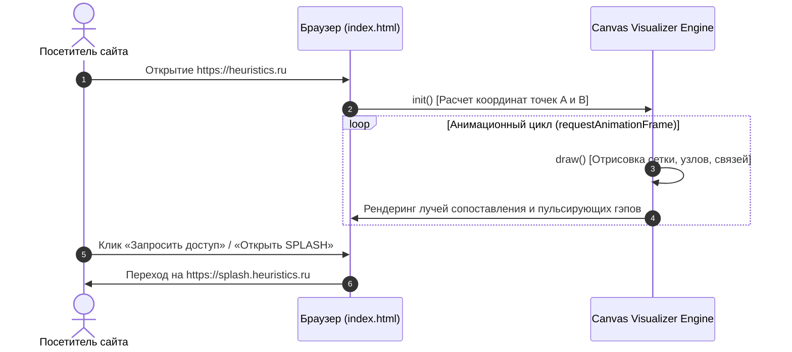
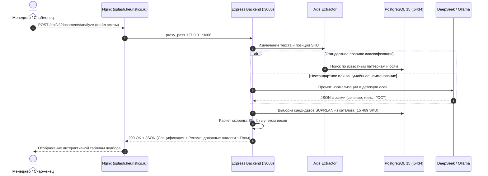

> 🤖 Документация сгенерирована автоматически с помощью скилла **arc42-documenter**.

# 6. Динамическое поведение (Runtime View)

## 6.1 Сценарий 1: Интерактивная анимация сопоставления объектов на `heuristics.ru`

При загрузке страницы `index.html` активируется Canvas-движок, визуализирующий осевой скоринг между сущностями выборки A и каталога B:

## 6.2 Сценарий 2: Обработка сметы и подбор аналогов в СПЛЭШ 2.0

Жизненный цикл обработки входящей PDF/Excel спецификации от конкурента:

