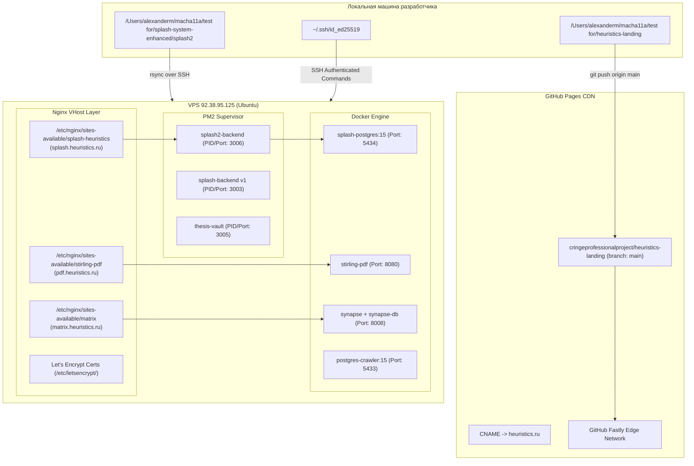

> 🤖 Документация сгенерирована автоматически с помощью скилла **arc42-documenter**.

# 7. Архитектура развертывания и инфраструктура (Deployment View)

## 7.1 Топология инфраструктуры

Развертывание экосистемы построено на комбинации статического хостинга (Edge CDN) и собственного выделенного VPS сервера.



## 7.2 Пошаговые инструкции деплоя

### 1. Деплой основного сайта (`heuristics.ru`)
* **Механизм:** Непрерывная публикация (CD) через GitHub Pages.
* **Команды:**
  ```bash
  cd "/Users/alexanderm/macha11a/test for/heuristics-landing"
  git add .
  git commit -m "Update site content and documentation"
  git push origin main
  ```
* **Время обновления:** 30–60 секунд после пуша.

### 2. Деплой и обновление СПЛЭШ 2.0 (`splash.heuristics.ru`)
* **Механизм:** `rsync` синхронизация файлов + `pm2 reload`.
* **Команды:**
  ```bash
  # Синхронизация кода
  rsync -avz -e "ssh -i ~/.ssh/id_ed25519" \
    --exclude 'node_modules' --exclude '.DS_Store' --exclude '.env' \
    "/Users/alexanderm/macha11a/test for/splash-system-enhanced/splash2/" \
    makuev@92.38.95.125:/home/makuev/splash2/

  # Перезапуск службы Node.js
  ssh -i ~/.ssh/id_ed25519 makuev@92.38.95.125 \
    'export NVM_DIR="$HOME/.nvm" && . "$NVM_DIR/nvm.sh" && pm2 restart splash2-backend'
  ```

### 3. Реконфигурация Nginx и SSL
* **Перезагрузка Nginx без простоя:**
  ```bash
  ssh -i ~/.ssh/id_ed25519 makuev@92.38.95.125 'echo hackhack7VA7 | sudo -S systemctl reload nginx'
  ```
* **Обновление SSL сертификатов (автоматически через Certbot):**
  ```bash
  sudo certbot renew --dry-run
  ```

## 7.3 Матрица портов и переменных окружения

| Сервис | Хост/Порт | Переменные окружения (.env) |
|---|---|---|
| **splash2-backend** | `127.0.0.1:3006` | `PORT=3006`, `DB_HOST=127.0.0.1`, `DB_PORT=5434`, `DB_NAME=splash2`, `JWT_SECRET=***` |
| **splash-postgres** | `0.0.0.0:5434` → `5432` | `POSTGRES_DB=splash2`, `POSTGRES_USER=splash_user`, `POSTGRES_PASSWORD=***` |
| **stirling-pdf** | `127.0.0.1:8080` | `SECURITY_ENABLELOGIN=true`, `SYSTEM_DEFAULTLOCALE=ru_RU` |
| **matrix-synapse** | `127.0.0.1:8008` | `SYNAPSE_SERVER_NAME=matrix.heuristics.ru`, `SYNAPSE_REPORT_STATS=no` |
